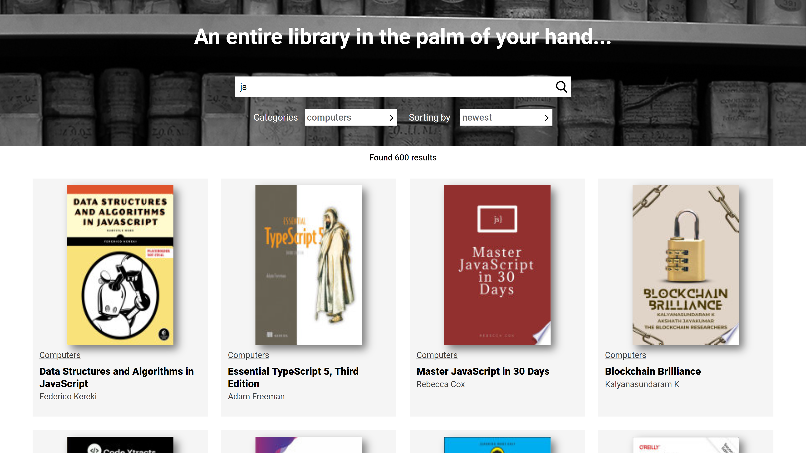
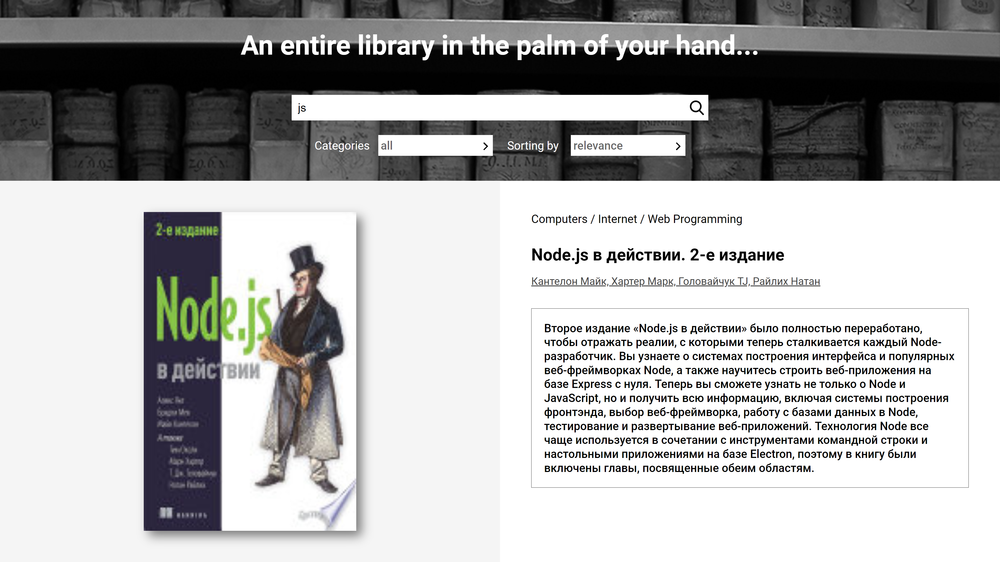

# react-test-assignment
Test assignment app. Loading data with [Google Book Api](https://developers.google.com/books)

## Tools
Key tools used in this test assignment are:

| Tool             | Description   |
| :-------------:|--------------|
| [TypeScript](https://github.com/microsoft/TypeScript) | Best language for application-scale JavaScript. |
| [React](http://facebook.github.io/react/index.html) | A JavaScript library for building user interfaces |
| [SASS](http://sass-lang.com/) | Sass is the most mature, stable, and powerful professional grade CSS extension language in the world |
| [Redux + Toolkit](https://redux-toolkit.js.org/) | Simple, opinionated, powerful toolset for Redux developement |
| [Axios](https://github.com/axios/axios) | Secure promise based HTTP client for the browser and node.js |
| [Nginx](https://nginx.org) | (Runs with docker container) |
| [Docker](https://www.docker.com) | Provides a suite of development tools to accelerate the delivery of secure applications |

## Installation
[node.js](http://nodejs.org/download/) is required to get ``npm``.

If you would like to download the code and run it without docker:

1. Clone the repo: `https://github.com/n0re5/react-test-assignment`
2. `cd react-test-assignment`
2. Install packages: `npm install`
3. Launch project: `npm start`
4. Open your browser at: `http://localhost:3000`

However, you can run the application using [Docker](https://www.docker.com/).

1. Clone the repo: `https://github.com/n0re5/react-test-assignment`
2. `cd react-test-assignment`
2. Build project: `docker-compose build`
3. Launch project: `docker-compose up`
4. Open your browser at: `http://localhost` or `http://localhost:80`